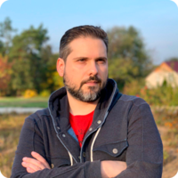

# Kostin Alex
***Front-End Developer***

## Contacts
* Location: Chisinau, Moldova
* Tel: +37360055446
* Email: keeper.gen@gmail.com
* Discord RS-School Name: Alex Kostin (@keepgen)
* GitHub: https://github.com/KeepGen

## About me
After almost 17 years of working at one place (starting as assistant and finishing as project manager), I decided that I want changes in my life (and job). I want to create something and be useful, to see how my work makes websites better. I'm highly motivated to become a front-end developer and be useful in the company where I will work soon.

I'm responsible person, my boss and colleagues counted on me during my work. That's why I was promoted up to project manager. I like to find out something new every day, so I will learn new things all the way!

## Professional Skills
* HTML & CSS (Sass)
* WordPress (Theme creation)
* Git & GitHub
* Figma & Photoshop (Photo editing, posters and postcards creating)
* JavaScript (Studying...)

## Code Example
```
function multiply(a, b){
  console.log(a * b);
  return a * b;
}
```